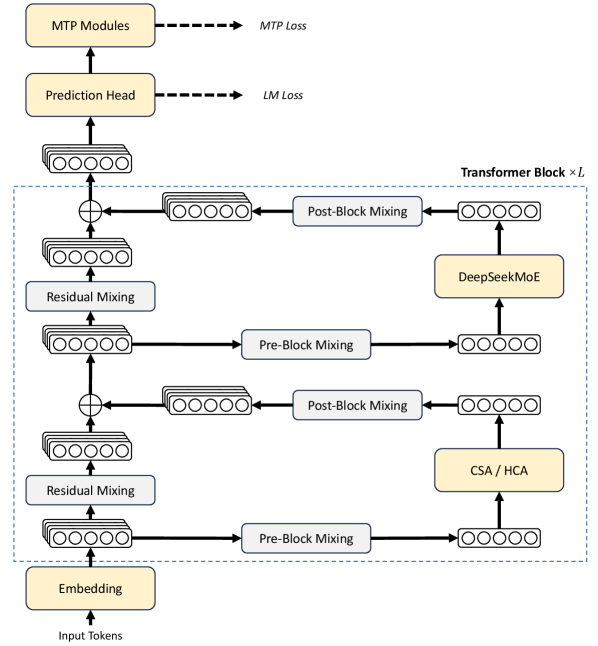
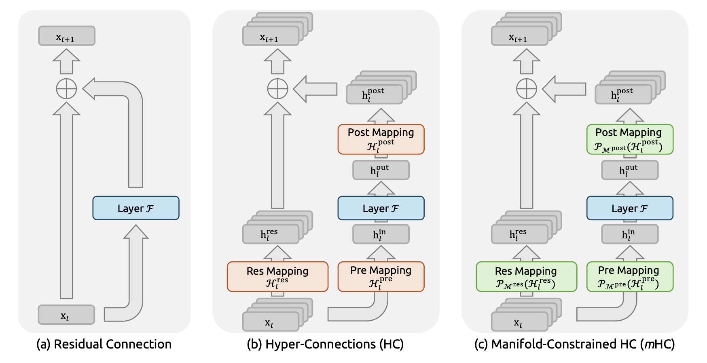
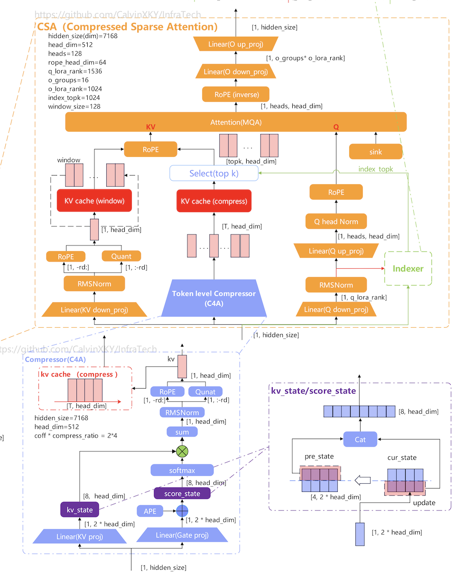
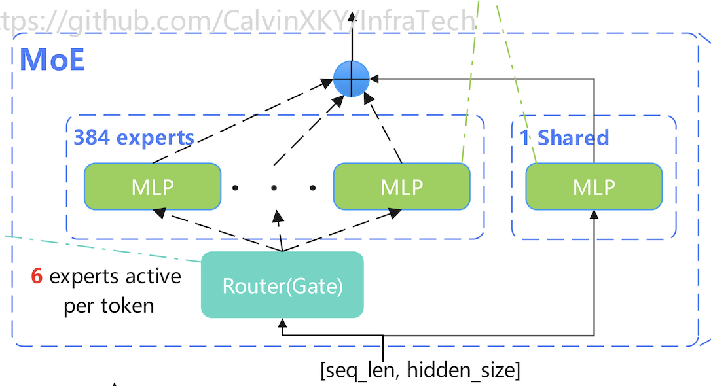

## DeepSeek-V4 模型结构介绍

### DeepSeek-V4 Flash 和 Pro 模型

DeepSeek-V4 系列包含两个核心版本：**DeepSeek-V4-Pro** 和 **DeepSeek-V4-Flash**。DeepSeek-V4-Pro 总参数量为 1.6T，每 Token 激活参数量为 49B；DeepSeek-V4-Flash 总参数量为 284B，每 Token 激活参数量为 13B。两个模型均支持 1M 长度上下文。

Flash 和 Pro 的模型结构基本一致，主要差异集中在参数规模、容量配置和长距离建模策略上。

两者的主要区别可以概括为：

- **Pro 更深**：`num_hidden_layers` 从 Flash 的 `43` 提升到 Pro 的 `61`
- **Pro 更宽**：`hidden_size` 从 `4096` 提升到 `7168`
- **Pro 的 attention 容量更大**：`num_attention_heads` 从 `64` 提升到 `128`
- **Pro 的 routed experts 更多**：`n_routed_experts` 从 `256` 提升到 `384`
- **Pro 的 expert 中间容量更大**：`moe_intermediate_size` 从 `2048` 提升到 `3072`
- **Pro 的长距离检索更激进**：`index_topk` 从 `512` 提升到 `1024`，整体更偏向长距离全局建模；而 Flash 更强调效率与均衡

### DeepSeek-V4 模型结构

#### 总体架构

DeepSeek-V4 系列仍然采用 Transformer 架构和 MTP（Multi-Token Prediction）模块，主要变化如下：

1. 引入 Manifold-Constrained Hyper-Connections（mHC）
2. 采用混合注意力架构，结合 Compressed Sparse Attention（CSA）和 Heavily Compressed Attention（HCA）
3. 采用 Muon 作为优化器
4. MoE 层细微调整（相较于 DeepSeek-V3）：将最初的几个 FFN 层替换为 Hash MoE 层

> DeepSeek-V4 模型结构图：[github.com/CalvinXKY/InfraTech/blob/main/models/deepseek_v4/deepseek_v4_architecture.jpg](https://github.com/CalvinXKY/InfraTech/blob/main/models/deepseek_v4/deepseek_v4_architecture.jpg)

#### mHC

mHC（Manifold-Constrained Hyper-Connections）是对传统残差连接的扩展。它将 hidden state 从一路扩展为多路，在 Attention / MoE 计算前通过 Pre Mapping 融合回一路，保持 Attention / MoE 的计算过程不变。对于 Attention 和 MoE 的输出结果，通过 Post Mapping 扩展回多路；同时多路残差通过 Res Mapping 进行特征融合，融合结果与 Post Mapping 结果相加，得到 mHC 的最终输出。

残差网络：$x_{l+1}=x_l+F_l(x_l)$

HC：$x_{l+1}=\mathcal{H}^{res}_{l}x_l+\mathcal{H}^{post}_{l}\mathcal{F}(\mathcal{H}^{pre}_{l}x_l,\mathcal{W}_l)$

mHC 在原始 HC 的基础上，对残差矩阵 $\mathcal{H}^{pre}_{l}$、$\mathcal{H}^{post}_{l}$ 和 $\mathcal{H}^{res}_{l}$ 施加约束，防止训练过程中权重出现数值爆炸（远大于 1）或数值弥散（趋近于 0），从而提升训练稳定性。

#### Hybrid Attention with CSA and HCA

##### Compressed Sparse Attention

CSA（Compressed Sparse Attention）：压缩率 $m=4$，每 4 个 token 的 KV 压缩为 1 个 entry，再在压缩后的 entries 上执行 DeepSeek Sparse Attention（DSA★）——每个 query 通过 lightning indexer 选择 top-k 个压缩 entry 进行 attention（V4-Pro 取 $k=1024$）。压缩过程使用两条独立的 KV 序列 $\mathcal{C}^{a}$、$\mathcal{C}^{b}$，结合 softmax 归一化的门控权重进行加权合并；相邻两个压缩块共享 $\mathcal{C}^{a}$ 与 $\mathcal{C}^{b}$ 的部分索引，形成重叠压缩。

##### Heavily Compressed Attention

HCA（Heavily Compressed Attention）：压缩率 $m'=128$，每 128 个 token 的 KV 压缩为 1 个 entry。

##### Compressor

DeepSeek-V4 采用了一种新的注意力架构：Compress-4-Attention（C4A）和 Compress-128-Attention（C128A）。具体来说，将每 4 或 128 个 token 的 $KV$ cache 压缩成一个，然后每个 token 与这些压缩后的 $KV$ cache 进行 Attention 计算。在长序列场景下，C4A 和 C128A 可以有效降低计算开销。

**C4A 层**

C4A 层的 Compressor 计算过程如下：给定输入 $X \in \mathbb{R}^{s \times h}$，其中 $s$ 为序列长度，$h$ 为 hidden size，首先计算其对应的 2 个 KV 输入 $C^a, C^b \in \mathbb{R}^{s \times d}$ 以及压缩权重 $Z^a, Z^b \in \mathbb{R}^{s \times d}$，其中 $d$ 为 head dimension。具体公式如下：

$$
\begin{aligned}
C^a &= X \cdot W^{aKV}, \quad C^b = X \cdot W^{bKV}, \\
Z^a &= X \cdot W^{aGate}, \quad Z^b = X \cdot W^{bGate},
\end{aligned}
$$

其中 $W^{aKV}, W^{bKV}, W^{aGate}, W^{bGate} \in \mathbb{R}^{h \times d}$ 是 C4A 对应 KV 和压缩权重的权重参数。

长度为 $s$ 的 KV 序列 $C^a, C^b$ 中，每 4 个 KV 被压缩为 1 个 $C^{\text{Comp}} \in \mathbb{R}^{\frac{s}{4} \times d}$，其第 $i$ 行 $C_{i}^{\text{Comp}} \in \mathbb{R}^{1 \times d}$ 的计算公式如下：

$$
\begin{aligned}
C_{i}^{\text{Comp}}
&= \frac{\sum_{j=4i}^{4(i+1)-1}{e^{Z_j^a+B_{j-4i}}} \odot C^a_j + \sum_{j=4(i+1)}^{4(i+2)-1}{e^{Z_j^b+B_{j-4i}}} \odot C^b_j}{\sum_{j=4i}^{4(i+1)-1}{e^{Z_j^a+B_{j-4i}}} + \sum_{j=4(i+1)}^{4(i+2)-1}{e^{Z_j^b+B_{j-4i}}}} \\
&= \left[1\right]_{1\times8} @ \bigl(\mathrm{softmax}\bigl(\left[Z^a_{\left[4(i-1)+1:4i,:\right]} ; Z^b_{\left[4i+1:4(i+1),:\right]}\right] + B\bigr) \odot \left[C^a_{\left[4(i-1)+1:4i,:\right]} ; C^b_{\left[4i+1:4(i+1),:\right]}\right]\bigr)
\end{aligned}
$$

其中 $B \in \mathbb{R}^{8 \times d}$ 为 $C^a, C^b$ 对应的 positional biases。

**C128A 层**

相较于 C4A，C128A 层的 Compressor 以更大的压缩率对 KV 序列进行压缩，且仅依赖单一 KV 序列 $C \in \mathbb{R}^{s \times d}$ 和压缩权重 $Z \in \mathbb{R}^{s \times d}$，其中：

$$
\begin{aligned}
C &= X \cdot W^{KV}, \\
Z &= X \cdot W^{Gate}
\end{aligned}
$$

使用fa$W^{KV}, W^{Gate}$ 是 C128A 对应 KV 和压缩权重的权重参数。

长度为 $s$ 的 KV 序列 $C$ 中，每 128 个 KV 被压缩为 1 个 $C^{\text{Comp}} \in \mathbb{R}^{\frac{s}{128} \times d}$，其第 $i$ 行为：

$$
\begin{aligned}
C_{i}^{\text{Comp}}
&= \frac{\sum_{j=128i}^{128(i+1)-1}{e^{Z_j+B_{j-128i}}} \odot C_j}{\sum_{j=128i}^{128(i+1)-1}{e^{Z_j+B_{j-128i}}}} \\
&= \left[1\right]_{1\times128} @ \bigl(\mathrm{softmax}\bigl(Z_{\left[128(i-1)+1:128i,:\right]} + B\bigr) \odot C_{\left[128(i-1)+1:128i,:\right]}\bigr)
\end{aligned}
$$

$i = 1, \cdots, \frac{s}{128}$，其中 $B \in \mathbb{R}^{128 \times d}$ 为 $C$ 对应的 positional biases。

#### MoE

专家的角色：

* **共享专家** ：处理**所有token都共享**的通识知识。
* **路由专家** ：每个token只激活n个。处理 **特定语境的知识** 。
