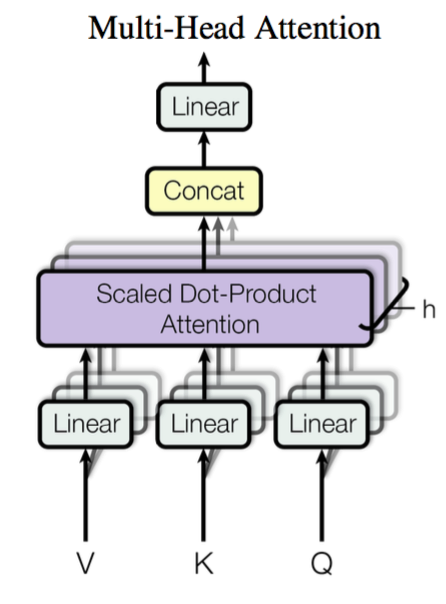
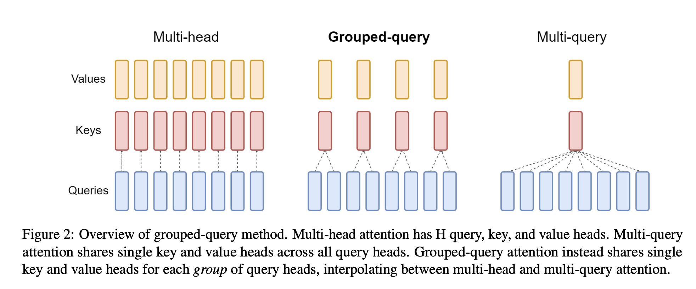
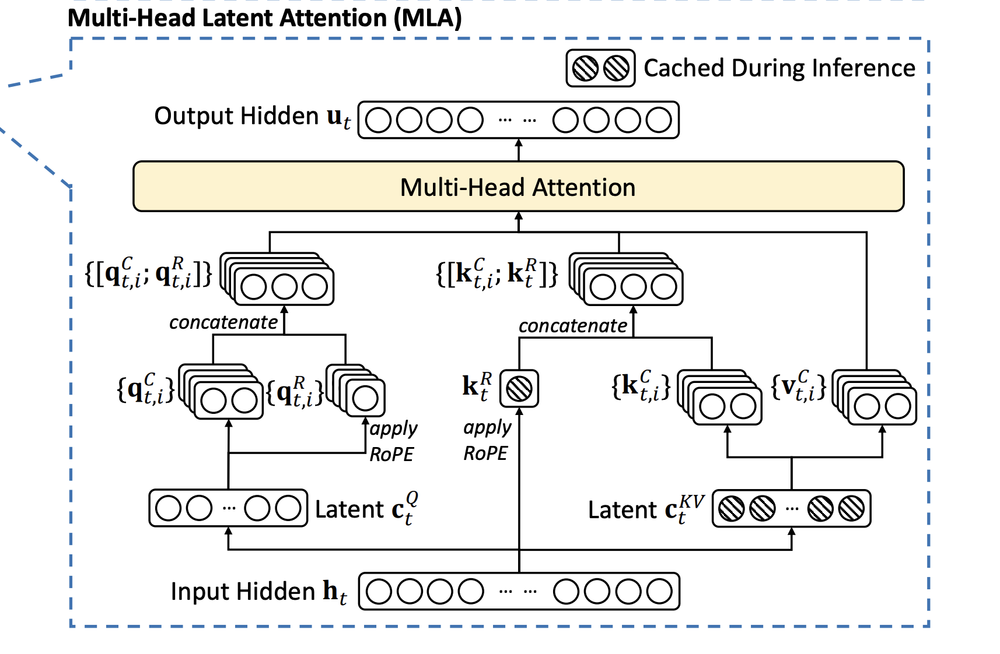
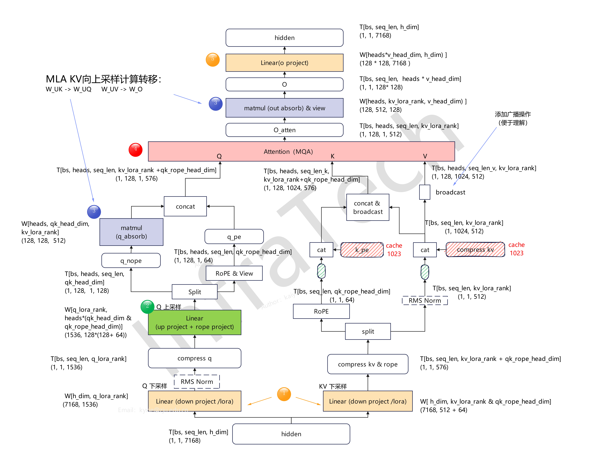
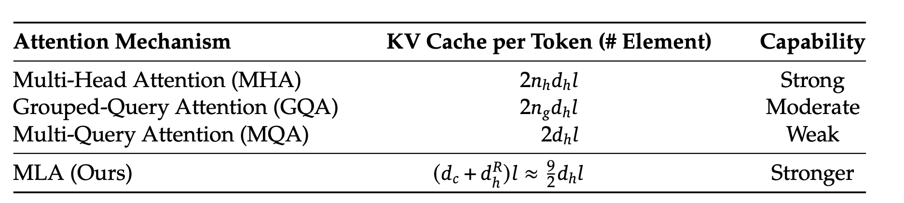
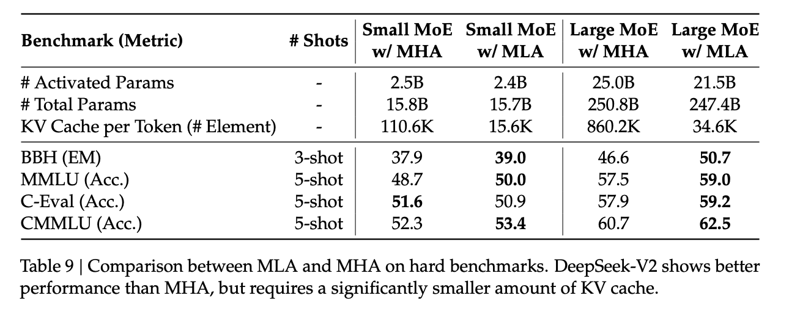
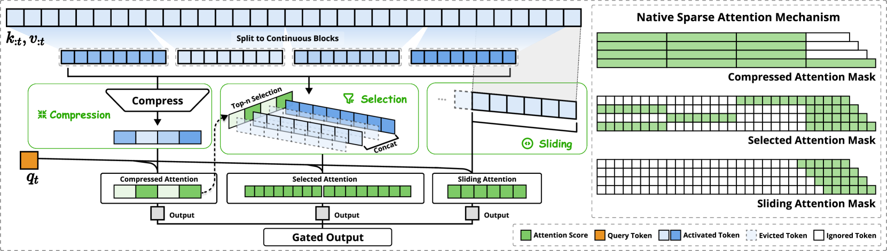
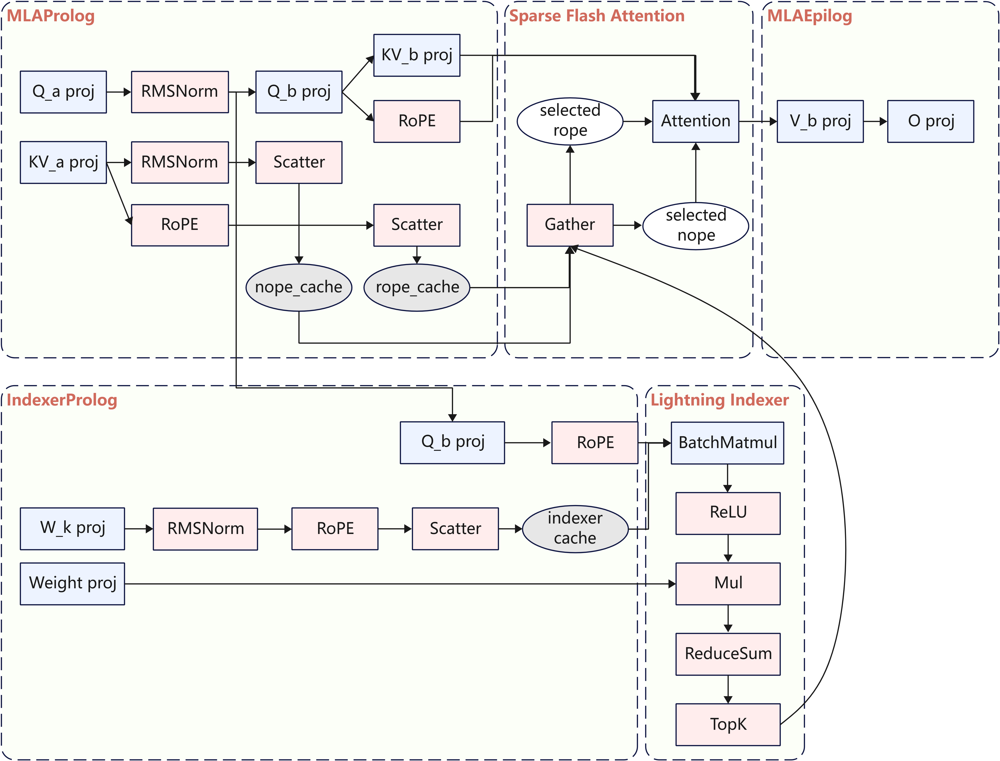

## Attention

### 演进图

```
【第一阶段：算法基础】
Self-Attention（单头基础）
    │
    ▼
Multi-Head Attention（MHA）──> 多视角表达，但 KV Cache 显存开销大
    │
    │【第二阶段：KV Cache 显存瘦身（改变 KV 结构）】
    ├──> Multi-Query Attention（MQA）/ Grouped-Query Attention（GQA）
    └──> Multi-head Latent Attention（MLA）
    │
    ▼【第三阶段：计算量与 IO 双重稀疏化（改变 Q-K 计算对）】
Native Sparse Attention（NSA）──> 静态 + 分块动态稀疏（硬件友好）
```

### Self-Attention

#### 原理

**核心机制**：单个 Query 向量与序列中所有 Key 向量做点积计算。

$$
\mathrm{Attention}(Q,K,V)=\mathrm{softmax}\left(\frac{QK^{T}}{\sqrt{d_k}}\right)V
$$

#### KV Cache 大小计算

假设：

- Batch size：$B$
- 序列长度：$S$
- Attention head 数量：$n_h$
- 每个 head 的维度：$d_h$

KV Cache：

$$
Size_{KV}=2 \times B \times S \times n_h \times d_h
$$

### Multi-Head Attention

#### 原理

多头注意力（Multi-Head Attention）机制首先通过线性映射将输入序列投影到特征空间，每组线性投影后的向量表示称为一个头（head），随后在每组投影序列上应用前文所述的缩放点积注意力，如下图所示：



1. 分割多个头：将变换后的查询 $Q$、键 $K$ 和值 $V$ 分别分割成多个头。假设有 $h$ 个头，每个头的维度为 $d_k$，则：

$$
d_k=\frac{d_{dim}}{h}
$$

其中，$d_{dim}$ 是模型的嵌入维度。

分割后的查询、键和值分别如下，其中 $i$ 表示第 $i$ 个头：

$$
Q_i=\mathrm{split}(Q,i)
$$

$$
K_i=\mathrm{split}(K,i)
$$

$$
V_i=\mathrm{split}(V,i)
$$

每个注意力头负责关注某一方面的语义相似性，多个头可使模型同时关注多个方面。因此，与简单的缩放点积注意力相比，多头注意力机制能够捕获更复杂的特征信息。

形式化表示为：

$$
head_i=Attention(QW_i^Q,KW_i^K,VW_i^V)
$$

$$
MultiHead(Q,K,V)=Concat(head_1,\cdots,head_h)
$$

最后，将各头结果拼接得到最终输出。

#### KV Cache 大小

假设：

- Batch size：$B$
- 序列长度：$S$
- Attention head 数量：$n_h$
- 每个 head 的维度：$d_h$

KV Cache 大小为：

$$
Size_{KV}=2 \times B \times S \times n_h \times d_h
$$

### Multi-Query Attention 和 Grouped-Query Attention

#### 原理

- **MHA（Multi-Head Attention）**：输入分别经过 $W_Q$、$W_K$、$W_V$ 投影后，将 $Q$、$K$、$V$ 均拆分为 $n$ 个注意力头（$n$ 为头数），每个头独立计算 Attention，最后将各头结果拼接。
- **MQA（Multi-Query Attention）**：保留多个 Query Head，仅对 $Q$ 进行多头切分；$K$、$V$ 不再按头划分，而是共享一组 $K$、$V$。多个 Query Head 复用同一份 $K$、$V$ 进行 Attention 计算，从而显著减少 KV Cache 开销，但可能带来一定的模型效果损失。
- **GQA（Grouped-Query Attention）**：
  GQA 是 MHA 和 MQA 之间的折中方案。$Q$ 保持多头结构，将多个 Query Head 分成若干组，同一组内的 Query Head 共享一组 $K$、$V$，不同组使用不同的 $K$、$V$。相比 MHA，GQA 减少了 KV Cache 开销；相比 MQA，保留了更多 $K$、$V$ 的表达能力，从而降低性能损失。
  可以将 MHA 看作 $K$、$V$ 头数最多的 GQA，将 MQA 看作 $K$、$V$ 头数最少的 GQA。



（论文：《GQA: Training Generalized Multi-Query Transformer Models from Multi-Head Checkpoints》，2023 年）

#### KV Cache 大小

假设：

- Batch size：$B$
- 序列长度：$S$
- Attention Head 数量：$n_h$
- 每个 Head 的维度：$d_h$
- 将所有 Head 划分为 $g$ 个组（$g$ 可整除 $n_h$）

对于 MQA，所有 Query Head 共享同一组 $K$、$V$，因此 KV Cache 降低至 MHA 的：

$$
\frac{1}{n_h}
$$

对于 GQA，将 Query Head 划分为 $g$ 组，同组内共享一组 $K$、$V$，因此 KV Cache 降低至 MHA 的：

$$
\frac{g}{n_h}
$$

### Multi-Head Latent Attention

#### 原理



##### Low-Rank Key-Value Joint Compression

> The core of MLA is the low-rank joint compression for keys and values to reduce KV cache.

$$
c_t^{KV}=W^{DKV}h_t
$$

$$
K_t^C=W^{UK}c_t^{KV}
$$

$$
V_t^C=W^{UV}c_t^{KV}
$$

其中，$c_t^{KV}\in\mathbb{R}^{d_c}$ 表示键和值压缩后的潜在向量；$d_c$（$\ll d_h n_h$）代表键值对的压缩维度；$W^{DKV}\in\mathbb{R}^{d_c\times d}$ 是下投影矩阵；$W^{UK},W^{UV}\in\mathbb{R}^{d_h n_h\times d_c}$ 分别是键和值的上投影矩阵。

在推理过程中，MLA 只需缓存 $c_t^{KV}$，因此其 KV Cache 仅包含 $d_c \cdot l$ 个元素，其中 $l$ 表示层数。

##### Decoupled Rotary Position Embedding

若在 $k_t^C$ 上直接施加 RoPE，RoPE 将与 $W^{UK}$ 耦合，导致推理时无法将 $W^{UK}$ 融合进 Query 投影，从而破坏 MLA 的推理效率。

解决方案：论文提出解耦 RoPE。

- 将 RoPE 单独应用到一组额外的 Query/Key 上。
- 最终的 Query 和 Key 由压缩部分与 RoPE 部分拼接得到。

$$
[q_{t,1}^{R};q_{t,2}^{R};\cdots;q_{t,n_h}^{R}]
=
q_t^R
=
\mathrm{RoPE}(W^{QR}c_t^Q)
$$

$$
k_t^R=\mathrm{RoPE}(W^{KR}h_t)
$$

$$
q_{t,i}=[q_{t,i}^{C};q_{t,i}^{R}]
$$

$$
k_{t,i}=[k_{t,i}^{C};k_{t,i}^{R}]
$$

$$
o_{t,i}
=
\sum_{j=1}^{t}
\mathrm{Softmax}_j
\left(
\frac{q_{t,i}^{T}k_{j,i}}
{\sqrt{d_h+d_h^R}}
\right)
v_{j,i}^{C}
$$

$$
u_t=W^O[o_{t,1};o_{t,2};\cdots;o_{t,n_h}]
$$

其中，$W^{QR}\in\mathbb{R}^{d_h^R n_h \times d_c^{'}}$ 和 $W^{KR}\in\mathbb{R}^{d_h^R \times d'}$ 分别是用于生成解耦查询和密钥的矩阵；$\mathrm{RoPE}(\cdot)$ 表示应用 RoPE 矩阵的操作；$[;]$ 表示拼接操作。

在推理过程中，解耦后的 Key 也需缓存。因此，DeepSeek-V2 的 KV Cache 总共包含：

$$
(d_c+d_h^R)l
$$

个元素。

##### 解耦 RoPE 说明

###### Attention 计算矩阵融合

在标准 Attention 中，Query 和 Key 分别通过线性投影得到：

$q_t=W^Qh_t$，$k_i=W^Kh_i$。

Attention score 计算为：

$$
score=q_t^Tk_i
$$

将 Query 和 Key 代入：

$$
score=(W^Qh_t)^T(W^Kh_i)
$$

根据矩阵转置规则：

$$
(AB)^T=B^TA^T
$$

可以得到：

$$
score=h_t^T(W^Q)^TW^Kh_i
$$

其中：

$$
(W^Q)^TW^K
$$

是一个与 token 位置无关的固定矩阵，因此可以提前计算：

$$
M=(W^Q)^TW^K
$$

在推理阶段，Attention score 可以直接表示为：

$$
score=h_t^TMh_i
$$

通过提前融合 Query 和 Key 的投影矩阵，可以避免推理过程中重复执行 Query 和 Key 的线性映射计算，从而降低计算开销。

###### MLA 直接使用 RoPE 的问题

RoPE（Rotary Position Embedding）通过旋转矩阵将位置信息注入 Query 和 Key。

对于 Key：

$k_i^R=R_i k_i$。

Attention score 计算为：

$$
score=(q_t^R)^T k_i^R
$$

展开得到：

$$
score=q_t^TR_t^TR_i k_i
$$

由于 RoPE 满足旋转矩阵性质：

$$
R_t^TR_i=R_{i-t}
$$

因此：

$$
score=q_t^TR_{i-t}k_i
$$

在 MLA（Multi-Head Latent Attention）中，Key 不再直接由隐藏状态计算，而是由低秩 KV latent 投影得到：

$$
k_i=W^{UK}c_i^{KV}
$$

代入 Attention score：

$$
score=h_t^T(W^Q)^TR_{i-t}W^{UK}c_i^{KV}
$$

可以看到，RoPE 旋转矩阵 $R_{i-t}$ 位于 $(W^Q)^T$ 和 $W^{UK}$ 两个投影矩阵之间。

由于矩阵乘法不满足交换律：

$$
R_{i-t}W^{UK}\neq W^{UK}R_{i-t}
$$

因此：

$$
(W^Q)^TR_{i-t}W^{UK}
$$

无法像普通 Attention 一样提前融合为固定矩阵。

这会破坏 MLA 所依赖的 Query-Key 投影融合，使低秩 Key 投影无法进行预计算融合，从而增加推理阶段的计算开销。

因此，MLA 需要采用解耦 RoPE（Decoupled RoPE）方案，将位置编码与低秩 Key 投影过程解耦，从而恢复 Query-Key 投影融合能力。

#### MLA Absorb



#### KV Cache 对比





### Native Sparse Attention

NSA（Native Sparse Attention）通过**动态分层稀疏策略**和**硬件对齐优化**，在保持模型性能的同时显著提升效率，主要包含以下创新：

- 压缩路径（Compression）：将长序列划分为块级（如每块 512 个 token），通过可学习的 MLP 压缩为粗粒度表示，捕获全局语义。
- 选择路径（Selection）：基于压缩块的注意力分数筛选出 Top-N 关键块，还原细粒度信息。
- 滑动窗口（Sliding Window）：固定窗口覆盖最近的局部 token，确保上下文连贯性。

三条路径的结果通过门控机制动态加权融合，避免模型因局部信息优势而忽略全局语义。



### DeepSeek Sparse Attention

其核心目标是**在不显著牺牲性能的前提下，大幅提升训练与推理效率**。


#### Lightning Indexer

Lightning Indexer 是 DSA 的关键组件，用于为每个 Query Token 选择最相关的 Key-Value Token，从而减少 Attention 计算量。

对于第 $t$ 个 Query Token $h_t \in \mathbb{R}^{d}$，Lightning Indexer 会与历史中的每个 Token $h_s \in \mathbb{R}^{d}$ 计算相关性得分：

$$
I_{t,s}
=
\sum_{j=1}^{H_I}
w_{t,j}^{I}
\cdot
\mathrm{ReLU}
(q_{t,j}^{I}\cdot k_s^{I})
$$

其中：

- $H_I$：Indexer Head 数量。
- $q_{t,j}^{I}$：第 $t$ 个 Token 在第 $j$ 个 Indexer Head 中的 Query 向量。
- $k_s^{I}$：第 $s$ 个 Token 的 Key 向量。该 Key 向量只有一份，由所有 Indexer Head 共享。

#### Fine-Grained Token Selection

基于上一步计算得到的 Index Score $I_{t,s}$，Lightning Indexer 从全部历史 Token 中选择 Top-$k$ 个最相关的 Key-Value Token，并仅对这些 Token 进行 Attention 计算：

$$
u_t=
\mathrm{Attn}
\left(
h_t,
\{c_s \mid I_{t,s}\in\mathrm{Top\text{-}k}(I_{t,:})\}
\right)
$$

其中：

- $c_s$：原始 Key-Value Cache Entry。
- $\mathrm{Top\text{-}k}(I_{t,:})$：根据 Query Token $t$ 对所有历史 Token 的相关性得分，选择得分最高的 $k$ 个 Token。


#### DSA整体过程

如下图所示,DSA的计算过程可分为MLAProlog、IndexerProlog、Lightning Indexer、Sparse Flash Attention、MLAEpilog五部分。

<p align="center">
  
</p>


