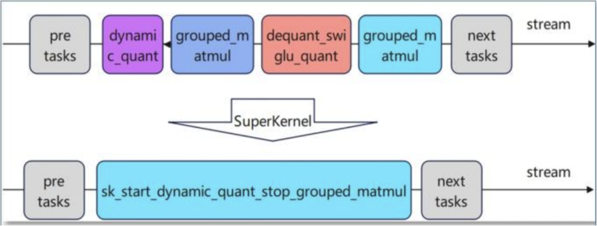

## SuperKernel 概述

SuperKernel 是一种算子二进制融合技术。与源码级融合不同，它聚焦于内核函数（Kernel）的二进制调度方案优化——在已编译的二进制代码基础上，将多个 Kernel 融合为一个超级 Kernel 函数（简称 SuperKernel）。

与单算子下发相比，SuperKernel 技术能够降低任务调度的等待时间和调度开销，并可利用 Task 间隙资源进一步优化算子头开销。



开启 SuperKernel 融合优化后，系统会自动识别图内可被融合的算子，在 SuperKernel 内以子函数调用的方式依次执行。同时，SuperKernel 支持用户根据实际业务需求手动标定融合范围，并对融合范围内的算子进行标记和优化配置。

## 融合规则

SuperKernel 融合会按照网络中算子的顺序依次判断是否可被融合。当识别到不可融合的算子时，系统会生成第一段 SuperKernel，并自动跳过该算子继续后续的 SuperKernel 融合。

> 不支持融合的算子问题定位请参考：[superkernel_cases.md](https://gitcode.com/Ascend/torchair/blob/master/docs/zh/appendix/cases/superkernel_cases.md)

## 使用方法

### GE-Graph 图模式

用户自行分析模型脚本中可被融合的算子，然后通过 `torchair.scope.super_kernel` 上下文标定融合范围。

```python
with torchair.scope.super_kernel(scope: str, options: str = ''):
    # 待融合的算子操作
```

| 参数        | 说明                                                                                                                                          |
| ----------- | --------------------------------------------------------------------------------------------------------------------------------------------- |
| `scope`   | 超 Kernel 名称，相同`scope` 的算子属于同一融合范围，由用户控制                                                                              |
| `options` | 融合的编译选项，详见[编译选项参考](https://www.hiascend.com/document/detail/zh/Pytorch/710/modthirdparty/torchairuseguide/torchair_00035.html) |

### npugraph_ex 图模式

**步骤 1（可选）：手动标定 SuperKernel 范围。**

使用 `super_kernel_scope_begin` / `super_kernel_scope_end` 标记融合范围，范围内的算子将被融合为一个 SuperKernel。

```python
torch.npu.super_kernel_scope_begin(scope_name: str)
# 待融合的算子操作
torch.npu.super_kernel_scope_end(scope_name: str)
```

- `scope_name`：融合后的 SuperKernel 名称，相同名称代表同一融合范围。若传入 `None`，则该范围内的算子不进行 SuperKernel 融合。

**步骤 2：通过 `options` 配置开启 SuperKernel 融合优化。**

```python
import torch
import torch_npu

opt_model = torch.compile(
    model,
    backend="npugraph_ex",
    options={
        "super_kernel_optimize": True,
        "super_kernel_optimize_options": dict,
        "super_kernel_debug_options": dict,
    },
    dynamic=False,
    fullgraph=True,
)
```

> 配置详情请参考 [npugraph_ex 使用文档](https://gitcode.com/Ascend/torchair/blob/master/docs/zh/npugraph_ex/npugraph_ex.md)
